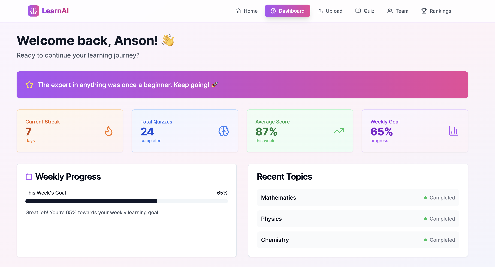
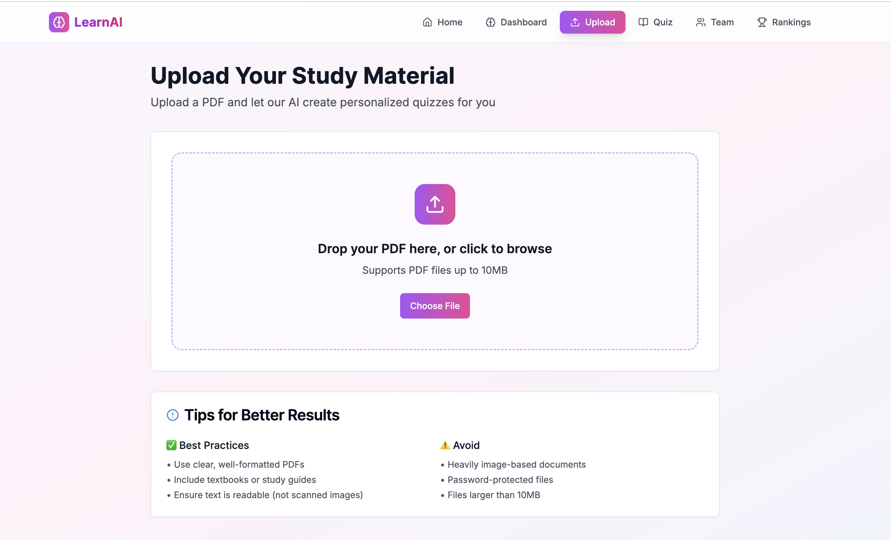
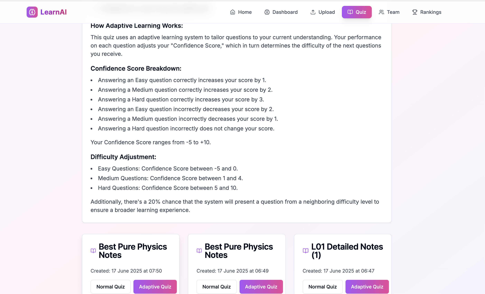
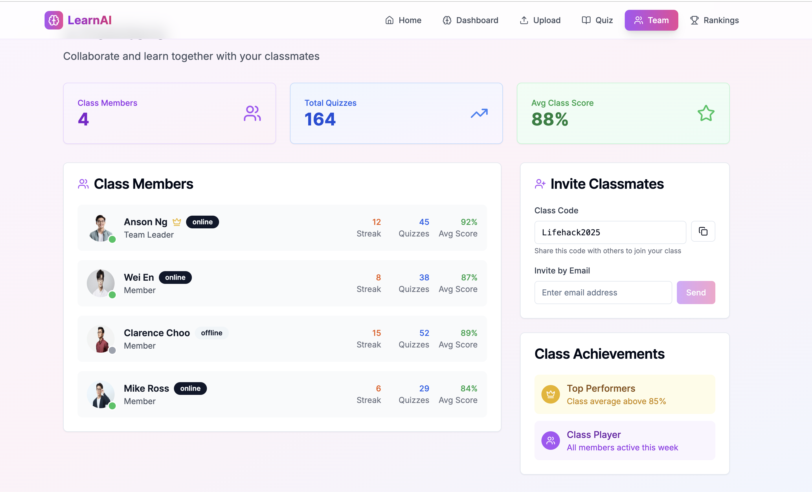
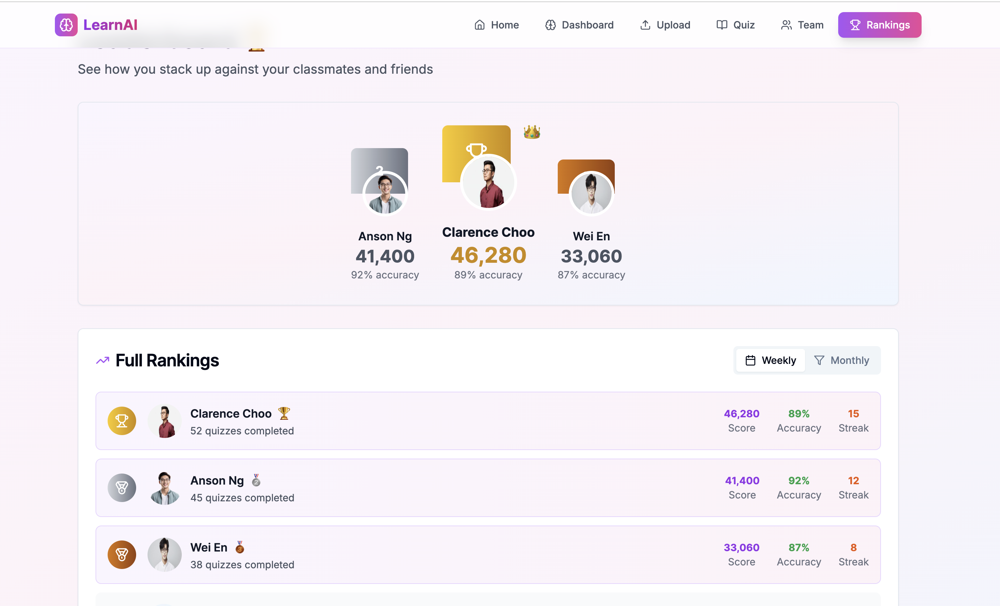

# LearnAI Platform

This project is an AI-powered platform designed to help students study more effectively by transforming their notes into quizzes.

### Features

*   **Quiz Generation**: Leverages the Gemini API to generate multiple-choice questions from uploaded text content, categorized by difficulty (Easy, Medium, Hard).
*   **PDF Processing**: Extracts textual content from PDF documents, enabling the AI to process and generate questions from various study materials.
*   **Interactive User Interface**: A modern and responsive Next.js application provides dashboards, quiz interfaces, team management, and ranking displays.
*   **Local Data Storage**: Utilizes SQLite for efficient storage of quiz data and other application-related information.
*   **Team Management & Rankings**: Features to organize users into teams and display their performance through a ranking system. This creates a gamified experience for the user, encouraging user retention and use of the platform.

### Screenshots

Here's a look at the application's user interface:

#### Dashboard Page

The dashboard page provides an overview of the application and quick access to it's key features.



#### Upload Page

Allows users to upload their study materials (e.g., PDF documents) for AI processing and quiz generation.



#### Quiz Page

Where users can take the AI-generated quizzes.



#### Team Page

Enables users to manage their teams and collaborate.



#### Rankings Page

Displays user and team rankings based on quiz performance.



### File Structure

```
.
├── lifehack2_25/
│   ├── Client/
│   │   └── my-app/                 # Next.js client application
│   │       ├── app/                # Next.js pages and routes
│   │       │   ├── dashboard/      # Dashboard page
│   │       │   │   └── page.tsx
│   │       │   ├── quiz/           # Quiz taking page
│   │       │   │   └── page.tsx
│   │       │   ├── rankings/       # User/Team rankings page
│   │       │   │   └── page.tsx
│   │       │   ├── team/           # Team management page
│   │       │   │   └── page.tsx
│   │       │   ├── upload/         # Document upload page
│   │       │   │   └── page.tsx
│   │       │   ├── globals.css     # Global styles
│   │       │   ├── layout.tsx      # Root layout for the application
│   │       │   └── page.tsx        # Home page
│   │       ├── components/         # Reusable UI components (Shadcn UI)
│   │       │   ├── navigation.tsx
│   │       │   ├── theme-provider.tsx
│   │       │   └── ui/             # Shadcn UI components
│   │       ├── hooks/              # Custom React hooks (e.g., use-mobile.tsx, use-toast.ts)
│   │       ├── lib/                # Utility functions (e.g., utils.ts)
│   │       ├── public/             # Static assets
│   │       ├── styles/             # Additional styles
│   │       ├── .gitignore          # Git ignore rules for client
│   │       ├── components.json     # Shadcn UI configuration
│   │       ├── next-env.d.ts       # Next.js environment type definitions
│   │       ├── next.config.mjs     # Next.js configuration
│   │       ├── package.json        # Client dependencies and scripts
│   │       ├── pnpm-lock.yaml      # pnpm lock file
│   │       ├── postcss.config.mjs  # PostCSS configuration
│   │       ├── tailwind.config.ts  # Tailwind CSS configuration
│   │       └── tsconfig.json       # TypeScript configuration
│   └── server/                     # Node.js Express backend
│       ├── src/
│       │   ├── index.js            # Main server entry point and API setup
│       │   ├── routes/             # Defines API routes
│       │   │   └── quiz.js         # Quiz-related API endpoints
│       │   └── utils/              # Utility functions
│       │       ├── gemini.js       # Gemini API integration for quiz generation
│       │       └── pdf.js          # PDF parsing utility
│       ├── .env                    # Environment variables for the server
│       ├── db.js                   # SQLite database connection and schema initialization
│       ├── package-lock.json       # npm lock file
│       ├── package.json            # Server dependencies and scripts
│       └── quiz.db                 # SQLite database file (generated on first run)
└── README.md                       # Project README file
```

### Getting Started

Follow these instructions to set up and run the project locally.

#### Prerequisites

Ensure you have the following installed on your system:

*   **Node.js**: Version 18 or higher. You can download it from [nodejs.org](https://nodejs.org/).
*   **npm**: npm comes with Node.js

#### Installation

1.  **Clone the repository:**
    ```bash
    git clone https://github.com/Weiennn/lifehack2_25.git
    cd lifehack2_25/lifehack2_25
    ```

2.  **Install Client Dependencies:**
    Navigate to the client directory and install the dependencies.
    ```bash
    cd Client/my-app
    npm install 
    ```

3.  **Install Server Dependencies:**
    Navigate to the server directory and install the dependencies.
    ```bash
    cd ../../server
    npm install
    ```

#### Environment Variables

Create a `.env` file in the `lifehack2_25/server/` directory. This file will store sensitive information like API keys.

```
GOOGLE_API_KEY=YOUR_GEMINI_API_KEY_HERE
PORT=3001 # Optional: Default is 3001 if not specified
```
Replace `YOUR_GEMINI_API_KEY_HERE` with your actual Google Gemini API key. You can obtain one from the [Google AI Studio](https://aistudio.google.com/app/apikey).

#### Running the Application

You need to run both the server and the client applications.

1.  **Start the Server:**
    Open a new terminal window, navigate to the server directory, and start the server.
    ```bash
    cd lifehack2_25/server
    npm run dev
    ```
    The server will be running at `http://localhost:3001`.

2.  **Start the Client:**
    Open another terminal window, navigate to the client directory, and start the Next.js development server.
    ```bash
    cd lifehack2_25/Client/my-app
    npm run dev 
    ```
    The client application will be accessible in your web browser at `http://localhost:3000`.

### Usage

Once both the client and server are running:

1.  Open your web browser and go to `http://localhost:3000`.
2.  **Upload Documents**: Navigate to the "Upload" section to upload your study notes in PDF format.
3.  **Generate Quizzes**: The platform will process your uploaded documents and generate quizzes based on the content.
4.  **Take Quizzes**: Engage with the generated quizzes to test your knowledge.
5.  **View Rankings**: Check your performance and compare with others on the rankings page.
6.  **Manage Teams**: If applicable, use the team section to manage your study groups.

### Technologies Used

*   **Client-side**:
    *   **Next.js**: React framework for building server-rendered and static web applications.
    *   **React**: JavaScript library for building user interfaces.
    *   **TypeScript**: Superset of JavaScript that adds static typing.
    *   **Tailwind CSS**: A utility-first CSS framework for rapid UI development.
    *   **Shadcn UI**: Reusable components built with Radix UI and Tailwind CSS.
*   **Server-side**:
    *   **Node.js**: JavaScript runtime environment.
    *   **Express.js**: Fast, unopinionated, minimalist web framework for Node.js.
    *   **SQLite3**: Lightweight, file-based relational database.
    *   **Multer**: Middleware for handling `multipart/form-data`, primarily used for uploading files.
    *   **PDF-Parse**: A utility to extract text from PDF files.
    *   **Gemini API**: Google's AI model for generating content, used here for quiz generation.
    *   **dotenv**: Module to load environment variables from a `.env` file.
    *   **cors**: Node.js package for providing a Connect/Express middleware that can be used to enable CORS with various options.
    *   **nodemon**: A tool that helps develop Node.js based applications by automatically restarting the node application when file changes in the directory are detected.
